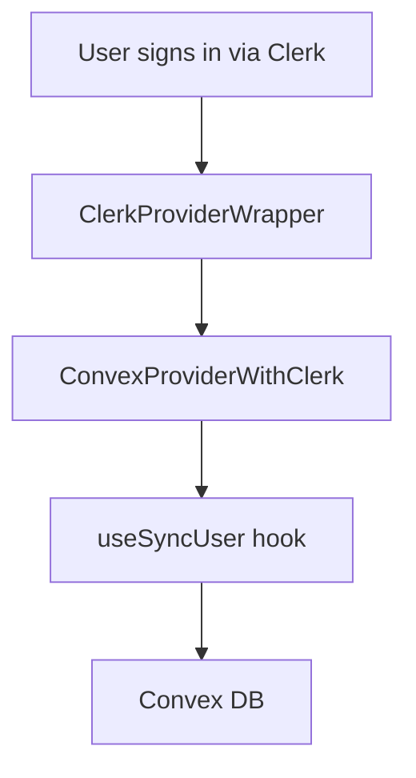

Shipr uses [Clerk](https://clerk.com) for authentication and session management, automatically syncing user data to Convex for backend operations.

## How It Works

1. **Clerk** handles sign-in, sign-up, session management, and billing plan metadata
2. **Convex** stores user data synced from Clerk via the `useSyncUser` hook
3. Users are identified by their Clerk ID across both systems

## Architecture



## User Sync Hook

The `useSyncUser` hook runs on authenticated pages and automatically syncs user data:

```typescript ~/workspace/source/src/hooks/use-sync-user.ts
"use client";

import { useAuth, useUser } from "@clerk/nextjs";
import { useMutation, useQuery } from "convex/react";
import { api } from "@convex/_generated/api";
import { useEffect } from "react";

export function useSyncUser() {
  const { user, isLoaded } = useUser();
  const { has } = useAuth();
  const plan =
    isLoaded && has ? (has({ plan: "pro" }) ? "pro" : "free") : undefined;
  const createOrUpdateUser = useMutation(api.users.createOrUpdateUser);
  const existingUser = useQuery(
    api.users.getUserByClerkId,
    user?.id ? { clerkId: user.id } : "skip",
  );

  useEffect(() => {
    if (!isLoaded || !user) return;

    // Only sync if user doesn't exist or data changed
    if (
      !existingUser ||
      existingUser.email !== user.primaryEmailAddress?.emailAddress ||
      existingUser.name !== user.fullName ||
      existingUser.imageUrl !== user.imageUrl ||
      existingUser.plan !== plan
    ) {
      createOrUpdateUser({
        clerkId: user.id,
        email: user.primaryEmailAddress?.emailAddress ?? "",
        name: user.fullName ?? undefined,
        imageUrl: user.imageUrl ?? undefined,
        plan,
      });
    }
  }, [user, isLoaded, plan, existingUser, createOrUpdateUser]);

  return { user, convexUser: existingUser, isLoaded };
}
```

## Convex Schema

Users are stored in Convex with the following schema:

```typescript ~/workspace/source/convex/schema.ts
users: defineTable({
  clerkId: v.string(),
  email: v.string(),
  name: v.optional(v.string()),
  imageUrl: v.optional(v.string()),
  plan: v.optional(v.string()), // "free" | "pro"
  onboardingCompleted: v.optional(v.boolean()),
  onboardingStep: v.optional(v.string()),
}).index("by_clerk_id", ["clerkId"])
```

| Field                  | Type       | Description                           |
| ---------------------- | ---------- | ------------------------------------- |
| `clerkId`              | `string`   | Clerk user ID (indexed)               |
| `email`                | `string`   | Primary email address                 |
| `name`                 | `string?`  | Full name                             |
| `imageUrl`             | `string?`  | Profile image URL                     |
| `plan`                 | `string?`  | Billing plan: `"free"` or `"pro"`    |
| `onboardingCompleted`  | `boolean?` | Whether onboarding is complete        |
| `onboardingStep`       | `string?`  | Current step in onboarding flow       |

## Environment Variables

```bash .env.example
# Clerk Authentication
NEXT_PUBLIC_CLERK_PUBLISHABLE_KEY=pk_test_...
CLERK_SECRET_KEY=sk_test_...
CLERK_JWT_ISSUER_DOMAIN=https://...clerk.accounts.dev
NEXT_PUBLIC_CLERK_SIGN_IN_URL=/sign-in
NEXT_PUBLIC_CLERK_SIGN_UP_URL=/sign-up
```

| Variable                            | Description                        |
| ----------------------------------- | ---------------------------------- |
| `NEXT_PUBLIC_CLERK_PUBLISHABLE_KEY` | Clerk publishable key              |
| `CLERK_SECRET_KEY`                  | Clerk secret key (server-side)     |
| `CLERK_JWT_ISSUER_DOMAIN`           | JWT issuer for Convex integration  |
| `NEXT_PUBLIC_CLERK_SIGN_IN_URL`     | Sign-in page route                 |
| `NEXT_PUBLIC_CLERK_SIGN_UP_URL`     | Sign-up page route                 |

## Route Groups

Shipr organizes routes using Next.js route groups:

- `(auth)` - Sign-in and sign-up pages using Clerk's prebuilt components
- `(dashboard)` - Protected pages requiring authentication
- `(marketing)` - Public pages (no auth required)

## Security

All Convex mutations and queries enforce ownership checks:

```typescript ~/workspace/source/convex/users.ts
export const createOrUpdateUser = mutation({
  args: {
    clerkId: v.string(),
    email: v.string(),
    name: v.optional(v.string()),
    imageUrl: v.optional(v.string()),
    plan: v.optional(v.string()),
  },
  handler: async (ctx, args) => {
    const identity = await ctx.auth.getUserIdentity();
    if (!identity) {
      throw new Error("Unauthorized: authentication required");
    }

    // Ensure users can only create/update their own record
    if (identity.subject !== args.clerkId) {
      throw new Error("Forbidden: cannot modify another user's data");
    }

    // ... create or update logic
  },
});
```

<Info>
The `identity.subject` from Clerk JWT is compared against the `clerkId` argument on every operation, ensuring users can only access their own data.
</Info>

## Checking User Plan

Use the `useUserPlan` hook to check the current user's billing plan:

```typescript ~/workspace/source/src/hooks/use-user-plan.ts
import { useUserPlan } from "@/hooks/use-user-plan";

function MyComponent() {
  const { isPro, isFree, plan, isLoading } = useUserPlan();

  if (isLoading) return <Skeleton />;
  if (isPro) return <ProFeature />;
  return <UpgradeCTA />;
}
```
