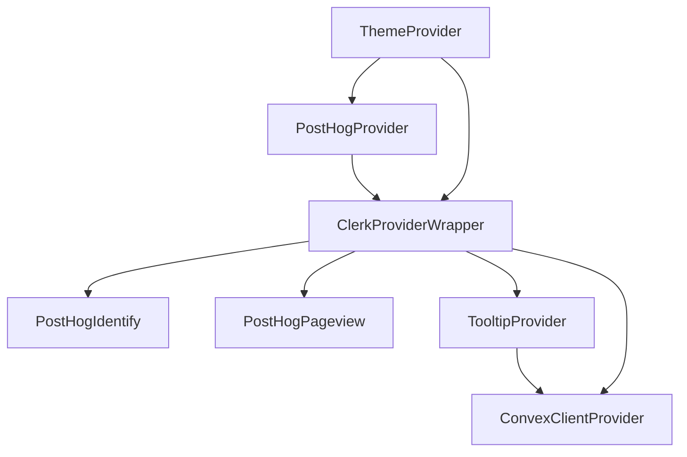

Shipr's provider stack wraps the entire application to provide theming, analytics, authentication, database access, and UI utilities. The order of providers is critical for proper functionality.

## Provider Stack Overview

All providers are configured in `src/app/layout.tsx:106-149`:

```tsx
<html lang="en" suppressHydrationWarning>
  <head>
    <OrganizationJsonLd />
    <WebSiteJsonLd />
  </head>
  <body>
    <ThemeProvider
      attribute="class"
      defaultTheme="system"
      enableSystem
      disableTransitionOnChange
    >
      <PostHogProvider>
        <ClerkProviderWrapper>
          <PostHogIdentify />
          <Suspense fallback={null}>
            <PostHogPageview />
          </Suspense>
          <TooltipProvider>
            <ConvexClientProvider>
              {children}
            </ConvexClientProvider>
          </TooltipProvider>
        </ClerkProviderWrapper>
      </PostHogProvider>
      <Toaster />
    </ThemeProvider>
    <Analytics />
    <SpeedInsights />
  </body>
</html>
```

## Provider Hierarchy

```
ThemeProvider (next-themes)
  └─ PostHogProvider (PostHog analytics)
      └─ ClerkProviderWrapper (Clerk auth)
          ├─ PostHogIdentify (links Clerk user to PostHog)
          ├─ PostHogPageview (tracks route changes)
          └─ TooltipProvider (shadcn/ui)
              └─ ConvexClientProvider (Convex + Clerk integration)
                  └─ {children} (Your app content)
```

## ThemeProvider

**Package:** `next-themes`  
**Location:** `src/components/theme-provider.tsx`  
**Purpose:** Light/dark/system theme management

### Configuration

```tsx
import { ThemeProvider as NextThemesProvider } from "next-themes";
import { type ThemeProviderProps } from "next-themes/dist/types";

export function ThemeProvider({ children, ...props }: ThemeProviderProps) {
  return <NextThemesProvider {...props}>{children}</NextThemesProvider>;
}
```

**Props in layout.tsx:**

```tsx
<ThemeProvider
  attribute="class"              // Use class="dark" for dark mode
  defaultTheme="system"          // Default to system preference
  enableSystem                   // Allow system theme detection
  disableTransitionOnChange      // Prevent FOUC on theme switch
>
```

### Usage in Components

```tsx
import { useTheme } from "next-themes";

export function ThemeToggle() {
  const { theme, setTheme } = useTheme();
  
  return (
    <button onClick={() => setTheme(theme === "dark" ? "light" : "dark")}>
      Toggle theme
    </button>
  );
}
```

**Why it's first:** All child components need access to theme state, including other providers.

## PostHogProvider

**Package:** `posthog-js`, `posthog-js/react`  
**Location:** `src/components/posthog-provider.tsx`  
**Purpose:** Product analytics and feature flags

### Configuration

```tsx
"use client";

import posthog from "posthog-js";
import { PostHogProvider as PHProvider } from "posthog-js/react";

if (typeof window !== "undefined") {
  posthog.init(process.env.NEXT_PUBLIC_POSTHOG_KEY!, {
    api_host: process.env.NEXT_PUBLIC_POSTHOG_HOST,
    person_profiles: "identified_only",
    capture_pageviews: false,  // We use PostHogPageview component
    capture_pageleave: true,
  });
}

export function PostHogProvider({ children }: { children: React.ReactNode }) {
  return <PHProvider client={posthog}>{children}</PHProvider>;
}
```

### PostHogIdentify Component

**Location:** `src/components/posthog-identify.tsx`  
**Purpose:** Link Clerk user identity to PostHog

```tsx
"use client";

import { useUser } from "@clerk/nextjs";
import { usePostHog } from "posthog-js/react";
import { useEffect } from "react";

export function PostHogIdentify() {
  const { user, isLoaded } = useUser();
  const posthog = usePostHog();
  
  useEffect(() => {
    if (isLoaded && user) {
      posthog.identify(user.id, {
        email: user.primaryEmailAddress?.emailAddress,
        name: user.fullName,
      });
    } else if (isLoaded && !user) {
      posthog.reset();  // Clear identity on sign out
    }
  }, [user, isLoaded, posthog]);
  
  return null;
}
```

### PostHogPageview Component

**Location:** `src/components/posthog-pageview.tsx`  
**Purpose:** Track route changes in App Router

```tsx
"use client";

import { usePathname, useSearchParams } from "next/navigation";
import { usePostHog } from "posthog-js/react";
import { useEffect } from "react";

export function PostHogPageview() {
  const pathname = usePathname();
  const searchParams = useSearchParams();
  const posthog = usePostHog();
  
  useEffect(() => {
    if (pathname) {
      let url = window.origin + pathname;
      if (searchParams.toString()) {
        url = url + `?${searchParams.toString()}`;
      }
      posthog.capture("$pageview", { $current_url: url });
    }
  }, [pathname, searchParams, posthog]);
  
  return null;
}
```

**Note:** Wrapped in `<Suspense>` to prevent blocking during static generation.

**Why PostHog is second:** It needs to initialize before Clerk so analytics are ready when user authentication happens.

## ClerkProviderWrapper

**Package:** `@clerk/nextjs`  
**Location:** `src/components/clerk-provider-wrapper.tsx`  
**Purpose:** User authentication and session management

### Configuration

```tsx
"use client";

import { ClerkProvider } from "@clerk/nextjs";
import { dark } from "@clerk/themes";
import { useTheme } from "next-themes";

export function ClerkProviderWrapper({ children }: { children: React.ReactNode }) {
  const { resolvedTheme } = useTheme();
  
  return (
    <ClerkProvider
      appearance={{
        baseTheme: resolvedTheme === "dark" ? dark : undefined,
      }}
    >
      {children}
    </ClerkProvider>
  );
}
```

**Key features:**

- **Theme adaptation:** Clerk UI matches app theme (light/dark)
- **Auto-sync:** Uses `useTheme()` from ThemeProvider
- **Session management:** Provides `useAuth()`, `useUser()`, `useSession()` hooks

### Environment Variables

```bash
NEXT_PUBLIC_CLERK_PUBLISHABLE_KEY=pk_test_...
CLERK_SECRET_KEY=sk_test_...
CLERK_JWT_ISSUER_DOMAIN=clerk.your-domain.com

# Optional: Customize Clerk URLs
NEXT_PUBLIC_CLERK_SIGN_IN_URL=/sign-in
NEXT_PUBLIC_CLERK_SIGN_UP_URL=/sign-up
NEXT_PUBLIC_CLERK_AFTER_SIGN_IN_URL=/dashboard
NEXT_PUBLIC_CLERK_AFTER_SIGN_UP_URL=/onboarding
```

### Usage in Components

```tsx
import { useAuth, useUser } from "@clerk/nextjs";

export function UserProfile() {
  const { isLoaded, userId } = useAuth();
  const { user } = useUser();
  
  if (!isLoaded) return <LoadingSpinner />;
  if (!userId) return <SignInButton />;
  
  return <div>Welcome, {user?.fullName}!</div>;
}
```

**Why Clerk is third:** It depends on ThemeProvider for theme state.

## ConvexClientProvider

**Package:** `convex/react`, `convex/react-clerk`  
**Location:** `src/lib/convex-client-provider.tsx`  
**Purpose:** Realtime database with Clerk authentication

### Configuration

```tsx
"use client";

import { ReactNode } from "react";
import { ConvexReactClient } from "convex/react";
import { ConvexProviderWithClerk } from "convex/react-clerk";
import { useAuth } from "@clerk/nextjs";

if (!process.env.NEXT_PUBLIC_CONVEX_URL) {
  throw new Error("Missing NEXT_PUBLIC_CONVEX_URL in your .env file");
}

const convex = new ConvexReactClient(process.env.NEXT_PUBLIC_CONVEX_URL);

export function ConvexClientProvider({ children }: { children: ReactNode }) {
  return (
    <ConvexProviderWithClerk client={convex} useAuth={useAuth}>
      {children}
    </ConvexProviderWithClerk>
  );
}
```

### Clerk + Convex Integration

Convex uses Clerk's JWT tokens for authentication. The integration requires:

**1. Convex auth config** (`convex/auth.config.ts:1-15`):

```ts
import { AuthConfig } from "convex/server";

export default {
  providers: [
    {
      domain: process.env.CLERK_JWT_ISSUER_DOMAIN,
      applicationID: "convex",
    },
  ],
} satisfies AuthConfig;
```

**2. ConvexProviderWithClerk** uses `useAuth` hook to:
- Get JWT token from Clerk session
- Send token with every Convex query/mutation
- Enable `ctx.auth.getUserIdentity()` in Convex functions

### Usage in Components

```tsx
import { useQuery, useMutation } from "convex/react";
import { api } from "@convex/_generated/api";

export function Dashboard() {
  const user = useQuery(api.users.getCurrentUser);
  const updateUser = useMutation(api.users.createOrUpdateUser);
  
  if (!user) return <LoadingSpinner />;
  
  return (
    <div>
      <h1>Welcome, {user.name}!</h1>
      <button onClick={() => updateUser({ name: "New Name" })}>
        Update Name
      </button>
    </div>
  );
}
```

**Why Convex is last:** It depends on Clerk's `useAuth()` hook for authentication.

## TooltipProvider

**Package:** `@radix-ui/react-tooltip` (via shadcn/ui)  
**Location:** `src/components/ui/tooltip.tsx`  
**Purpose:** Shared tooltip context for UI components

### Configuration

```tsx
import { TooltipProvider } from "@/components/ui/tooltip";

<TooltipProvider>
  {children}
</TooltipProvider>
```

**Default delay:** 200ms (configurable via `delayDuration` prop)

### Usage in Components

```tsx
import {
  Tooltip,
  TooltipContent,
  TooltipTrigger,
} from "@/components/ui/tooltip";

export function HelpButton() {
  return (
    <Tooltip>
      <TooltipTrigger asChild>
        <button>Help</button>
      </TooltipTrigger>
      <TooltipContent>
        <p>Click for help</p>
      </TooltipContent>
    </Tooltip>
  );
}
```

## Additional Components

### Toaster

**Package:** `sonner`  
**Location:** `src/components/ui/sonner.tsx`  
**Purpose:** Toast notifications

```tsx
import { Toaster } from "@/components/ui/sonner";

<ThemeProvider>
  {children}
  <Toaster />  {/* Rendered outside main provider tree */}
</ThemeProvider>
```

**Usage:**

```tsx
import { toast } from "sonner";

export function SaveButton() {
  const handleSave = async () => {
    try {
      await saveData();
      toast.success("Saved successfully!");
    } catch (error) {
      toast.error("Failed to save");
    }
  };
  
  return <button onClick={handleSave}>Save</button>;
}
```

### Analytics & SpeedInsights

**Packages:** `@vercel/analytics`, `@vercel/speed-insights`  
**Location:** `src/app/layout.tsx:145-146`  
**Purpose:** Vercel web analytics and performance monitoring

```tsx
import { Analytics } from "@vercel/analytics/react";
import { SpeedInsights } from "@vercel/speed-insights/next";

<body>
  {/* ... providers ... */}
  <Analytics />
  <SpeedInsights />
</body>
```

**Automatic tracking:**
- Page views
- Web vitals (LCP, FID, CLS, TTFB, FCP)
- No configuration required on Vercel

## Provider Dependency Graph



**Key dependencies:**

1. **ClerkProviderWrapper** depends on **ThemeProvider** for theme state
2. **PostHogIdentify** depends on **ClerkProviderWrapper** for user data
3. **ConvexClientProvider** depends on **ClerkProviderWrapper** for `useAuth()` hook

## Environment Variables

All required environment variables for providers:

```bash
# Clerk (required)
NEXT_PUBLIC_CLERK_PUBLISHABLE_KEY=pk_test_...
CLERK_SECRET_KEY=sk_test_...
CLERK_JWT_ISSUER_DOMAIN=clerk.your-domain.com

# Convex (required)
NEXT_PUBLIC_CONVEX_URL=https://your-deployment.convex.cloud

# PostHog (optional)
NEXT_PUBLIC_POSTHOG_KEY=phc_...
NEXT_PUBLIC_POSTHOG_HOST=https://app.posthog.com
```

## Common Patterns

### Accessing User Data

```tsx
import { useUser } from "@clerk/nextjs";        // Clerk user
import { useQuery } from "convex/react";
import { api } from "@convex/_generated/api";

export function UserDisplay() {
  const { user: clerkUser } = useUser();                    // Clerk session
  const convexUser = useQuery(api.users.getCurrentUser);    // Convex DB record
  
  return (
    <div>
      <p>Email: {clerkUser?.primaryEmailAddress?.emailAddress}</p>
      <p>Plan: {convexUser?.plan}</p>
    </div>
  );
}
```

### Theme-aware Styling

```tsx
import { useTheme } from "next-themes";

export function ThemedComponent() {
  const { resolvedTheme } = useTheme();
  
  return (
    <div className={resolvedTheme === "dark" ? "bg-black" : "bg-white"}>
      Content
    </div>
  );
}
```

### Analytics Tracking

```tsx
import { usePostHog } from "posthog-js/react";

export function UpgradeButton() {
  const posthog = usePostHog();
  
  const handleUpgrade = () => {
    posthog.capture("upgrade_clicked", {
      plan: "pro",
      source: "dashboard",
    });
    // ... upgrade logic
  };
  
  return <button onClick={handleUpgrade}>Upgrade</button>;
}
```

## Troubleshooting

### Hydration Errors

**Problem:** Theme flicker or hydration mismatch  
**Solution:** Add `suppressHydrationWarning` to `<html>` tag

```tsx
<html lang="en" suppressHydrationWarning>
```

### Clerk Theme Not Updating

**Problem:** Clerk UI doesn't match app theme  
**Solution:** Ensure ClerkProviderWrapper uses `resolvedTheme` not `theme`

```tsx
const { resolvedTheme } = useTheme();  // ✅ Use resolvedTheme
const { theme } = useTheme();          // ❌ May be "system"
```

### PostHog Not Tracking

**Problem:** Events not appearing in PostHog  
**Solution:** Check environment variables and init config

```tsx
// Verify in browser console:
console.log(posthog.get_config());
```

### Convex Auth Errors

**Problem:** `Unauthenticated` errors in Convex queries  
**Solution:** Verify `CLERK_JWT_ISSUER_DOMAIN` matches Clerk dashboard

```bash
# Get from Clerk Dashboard > API Keys > Advanced > JWT Template
CLERK_JWT_ISSUER_DOMAIN=clerk.your-domain.com
```

## Next Steps

<CardGroup cols={2}>
  <Card title="Architecture" icon="sitemap" href="/guides/architecture">
    Learn about the overall tech stack and data flow
  </Card>
  <Card title="Authentication" icon="shield" href="/guides/authentication">
    Deep dive into Clerk authentication setup
  </Card>
  <Card title="Convex Guide" icon="database" href="/guides/convex">
    Learn how to write queries and mutations
  </Card>
  <Card title="Theming" icon="palette" href="/guides/theming">
    Customize colors and styles
  </Card>
</CardGroup>